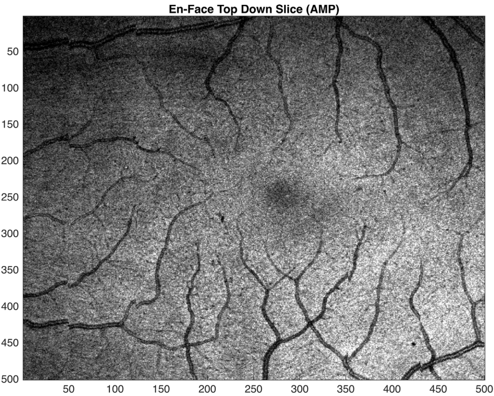

# OCT-Volume-Generator
This project is the culmination of my acquired knowledge from SBME's Optical Linear Systems course and weeks of development and research. This project was presented as a term project and obtained a grade of 98% for exceeding expectations as it was a comprehensive, accurate, and generates viable retinal cross section volumes from raw OCT data obtained from VGH's Clinical Trial OCT System. I would like to thank UBC's Professor Myeong Jin Ju, and Nueralink Engineer Andrew Chan as they have taught me a great deal about the subject of OCT image signal processing and have written many sections and functions this code relies on.

## Instructions
1. Ensure that both the Image Processing Toolbox and Signal Processing Toolbox plugins are installed on your instance of Matlab.
2. Download all files and open OCT_main.mlx in Matlab and click Run. The code is segmented so that if you want to follow along the processing step by step you could.
3. By default the code will create an OCT_Vol_Uncorrected.mat file, and a OCT_Vol_Corrected.tiff file.
4. The tiff stack can be viewed using a standard tiff viewer like ImageJ.
5. To view the tiff stack using ImageJ open the file and navigate to plugins > 3D > Volume Viewer. (If your copy of ImageJ doesn't include volume viewer you can separately install it following the instructions under the ImageJ web guide)
6. If you want to view the volume in matlab use this command after running the main code: "sliceViewer(mat2gray(20.*log10(abs(OCT_tcorr_fit))));"

Thats it, you have a manipulable 3D volume that can be used for diagnoses.

## Results
 

